# ComfyUI-ForgeNeo-Bridge

[日本語](#japanese) · **[English ↓](#english)**

<a id="japanese"></a>

## Forge画像をドロップして、編集可能なワークフローへ

**Forge Neoで生成した画像をComfyUIへドラッグ＆ドロップすると、画像の生成情報からワークフローを自動作成するカスタムノードです。** プロンプト、モデル名、シード、Steps、CFG、Sampler、Scheduler、サイズなどを読み取り、モデル系統に応じたノードを接続します。読み込み後もComfyUI上で自由に編集できます。

専用アプリで設定を編集したり、配布ワークフローJSONを先に用意したりする必要はありません。**生成情報が残っている元のPNG／WebP／JPEG**をドロップしてください。生成は通常のRun／Queue操作で開始します。

### 再生成の例：Illustrious / SDXL

<table>
<tr><th>Forge Neoの元画像</th><th>ComfyUIで再生成</th></tr>
<tr>
<td><a href="docs/media/forge-illustrious.webp"></a></td>
<td><a href="docs/media/comfy-illustrious.png"></a></td>
</tr>
</table>

モデル：`waiIllustriousSDXL_v170`。Seed **424011486**、Euler a、30 steps、CFG 7、1024×1344。Hires.fixはLanczos・2倍・20 steps・CFG 4.5・denoise 0.5です。画像ファイルは2048×2688の原寸を維持し、HTML上の表示幅だけを小さくしています。

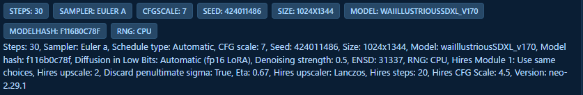

元画像に記録された設定です。**Hires.fixではForge NeoとComfyUIで若干異なる結果になることがあります。** 拡大・VAEの再エンコード・サンプリングなどの差により、条件によっては構図や細部により大きな差も出ます。この比較は一例であり、画像の一致や、どのモデルでも近い結果になることを保証するものではありません。

左の元画像はForge生成情報からの再構築用です。右のようにComfyUIのワークフローが埋め込まれた画像は、ComfyUI本来のワークフロー読み込みを優先します。

### インストール・更新

ComfyUIの`custom_nodes`フォルダで実行します。

```powershell
git clone https://github.com/ukr8b3g-cmyk/ComfyUI-ForgeNeo-Bridge.git
```

更新はこのリポジトリ内で`git pull --ff-only`。その後、**ComfyUIを再起動してブラウザーを再読み込み（F5）**してください。以前の不完全なHiresワークフローは、元画像を再ドロップして作り直します。

ComfyUI標準の依存関係を利用し、起動時のpip実行やモデルの自動ダウンロードは行いません。Larkは専用の名前空間で同梱しています。[ライセンス情報](THIRD_PARTY_NOTICES.md)も参照してください。

### 画像を読み込むとどうなる？

1. Forge Neoの元画像をComfyUIのキャンバスへドロップします。
2. モデル・Text Encoder・VAE・LoRAを、ComfyUIに登録されたフォルダから照合します。
3. 読み取った値でノードを接続し、見やすく配置します。
4. 必要ならプロンプトや設定を編集して、Runを押します。

`ForgeNeo Bridge: canvas image to workflow`は**初期ON**です。モデル照合は登録された相対パス、完全なファイル名、拡張子を除いた完全名を使います。ファイルがない・候補が複数ある場合は勝手に別モデルを選ばず、不足情報と元の名前を残します。必要なLoaderを修正してください。ドロップだけで重みをGPUへロードしたり、生成を開始したりはしません。

### モデル別の自動配線と検証範囲

「ワークフローを組み立てられること」と「Forge画像に近い結果を出せること」は別です。

| 系統 | 作成するワークフロー | 確認状況・注意点 |
|---|---|---|
| SD1.5 | 標準Checkpoint Loader＋Bridge Prompt／Settings／Sampler | LCM＋LoRA＋Lanczos Hiresの実生成完走を確認。元画像と構図・衣装の差あり |
| SDXL / Illustrious | 標準Checkpoint Loader＋Bridge経路 | 上記の比較画像を掲載。すべてのモデル・条件の一致は未検証 |
| Anima | 個別のモデル／TE／VAE Loader＋Bridge経路 | `waiANIMA_v10Base10`のLanczos Hiresを補正OFF／ONでGPU完走、ユーザー動作確認済み |
| Z-Image（ZIT） | モデル別の標準ノードを自動配線 | ローカルの互換構成でGPU生成・出力確認済み。元の重みとの完全一致は未検証 |
| ERNIE | モデル別の標準ノードを自動配線 | 互換量子化モデルでGPU生成・出力確認済み。元の重みとの完全一致は未検証 |
| Qwen-Image / Edit 2511・2509・初代 | 通常生成と参照画像編集を区別して標準ノードを配線 | 2511 int8＋Lightning LoRAの参照なし生成はGPU完走。2509・初代・参照画像編集はGPU未検証 |
| Qwen-Image 2.1 / Krea2 | モデル別の標準ノードを自動配線 | レシピ実装あり。今回のGPU検証対象外。Qwen 2.1の参照画像編集は未対応 |
| Flux.1 Dev / Schnell | DualCLIPLoaderなどの標準ノードを配線 | モデル未所持。仕様・配線テストのみ、GPU未検証 |
| Flux.2 Klein / Dev | Flux2Scheduler＋SamplerCustomAdvancedなどを配線 | モデル別レシピあり。今回のGPU検証対象外 |

Wan動画は対象外です。Lumina2／PiDは対応レシピがなく、誤ったCheckpoint経路へ置き換えません。GGUFなど追加Loaderが必要なモデル形式の実行は保証しません。編集画像のメタデータだけから、編集前の参照画像を復元することはできません。

`auto`は万能な互換モードではなく、**明示値がない項目を、モデルや対応プロファイルに従って扱う表示**です。Clip Skip、Shift、Sigma min/max、Rhoなどで使われます。`automatic`というScheduler名は別の設定です。Z-Image・Qwen・ERNIEなどの標準ノード経路と、Bridge専用Samplerの設定は区別してください。

### Settings：普段使う項目

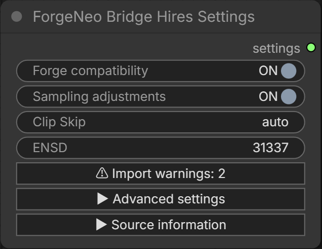

通常のSettingsとHires Settingsは、それぞれ対応するSamplerへ接続します。**この画像はSampling adjustmentsをONにした例です。新規読み込み時の初期値はOFFです。** Hiresの前後段で互換・補正スイッチを操作すると、接続された相手の同じスイッチも連動します。

| 項目 | 役割 |
|---|---|
| **Forge compatibility — 初期ON** | Forge用のテキスト処理・初期ノイズなどを使う親スイッチ。OFFでは同じBridgeノード内でComfyUI標準処理を使います。標準ノードへの変換ではなく、OFFでもBridgeのインストールは必要です |
| **Sampling adjustments — 初期OFF** | 共通処理を利用しつつ、再現性に影響するサンプリング・Sigma・途中ノイズ・CFG補助の差を補います。既に互換性がある共通部分を使うだけならONは不要です |
| Clip Skip | テキストエンコーダーの層の扱い。SD1.5／SDXLとAnima・LLM系では適用が異なります。Animaでは非適用です |
| ENSD | Eta Noise Seed Delta。追加ノイズの乱数系列に関係する値です。補正OFFでは保存されますが適用されません |
| Import warnings | 不足・推定・未対応事項を表示。同じボタンをもう一度押すと閉じます |

**Sampling adjustmentsは内部処理の互換性を高める補助機能であり、同一画像や近いレンダリング結果を保証しません。ONにすると必ず元画像へ近づく、という意味でもありません。** 同名サンプラーでも途中ノイズやスケジュールが違う場合があります。補正項目がない旧ワークフローは従来動作を守るためONで読み込み、新規ノード／画像ドロップはOFFです。

| Forge compatibility | Sampling adjustments | 動作 |
|---|---|---|
| OFF | 非適用 | ComfyUI標準のテキスト・ノイズ・KSampler処理 |
| ON | OFF（初期値） | Forge用テキスト・初期ノイズ＋ComfyUIのSampler／Sigma列 |
| ON | ON | 上記にForge向けのサンプリング差分補正を適用 |

### 詳細設定：必要な項目だけ展開

詳細設定は初期状態で折りたたまれ、閉じても値は保持されます。以下は展開した画面から該当箇所を切り出したものです。設定ラベルとマウスオーバーヘルプはComfyUIの日本語／英語設定に従います。ヘルプ表示にはComfyUIの`Enable Tooltips`を有効にしてください。

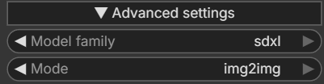

**Model family / Mode：** 自動判定したモデル系統と生成モードです。Hiresの1段目はtxt2img、2段目はimg2imgになります。

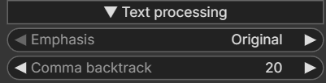

**Text processing：** Emphasisは括弧などの強調構文の扱い、Comma backtrackは長いプロンプトの区切り位置の扱いです。Forge compatibilityがONのときに使用します。

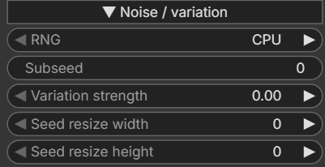

**Noise / variation：** RNGは初期ノイズの乱数方式、SubseedとVariation strengthはバリエーション用のシードと混合量です。Seed resize width/heightは初期ノイズの基準サイズであり、出力画像のサイズではありません。

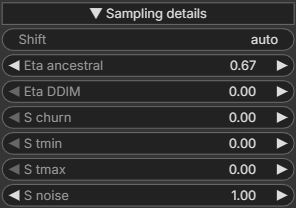

**Sampling details：** Shiftは対応するFlowモデルの時間・ノイズ尺度、Etaは対応サンプラーの確率的ノイズ量です。S churn／S tmin／S tmax／S noiseは途中ノイズの設定です。適用は選択したサンプラーと補正スイッチに従います。

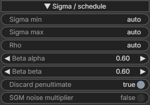

**Sigma / schedule：** Sigmaの範囲、Rho、Betaのパラメーター、末尾直前のSigma除去などを扱います。SGM noise multiplierは初期ノイズの倍率規則であり、Scheduler名ではありません。補正OFFではこれらの手動補正は保存のみです。

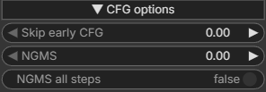

**CFG options：** Skip early CFGは初期区間のCFG処理、NGMSは負の条件付けを省略する判定、NGMS all stepsはその適用範囲に関係します。互換・補正ONかつ対応経路で使用します。

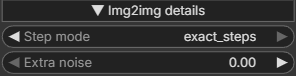

**Img2img details：** Step modeはステップ数とdenoiseの解釈、Extra noiseは追加ノイズです。Hires段もこの設定を使います。補正OFFではComfyUI標準の解釈になります。

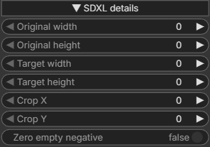

**SDXL details：** 元サイズ・目標サイズ・クロップ座標はSDXLへの追加条件です。出力解像度は接続したLatent／拡大ノードで編集します。Zero empty negativeは空の負条件の扱いです。この節はSDXLの場合に表示されます。

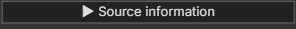

**Source information：** 元画像から読み取った情報を確認する独立した開閉項目です。画像は閉じた状態のボタンです。出典情報を保持し、ComfyUIで編集した現在値を勝手に元へ戻しません。

### プロンプトノード

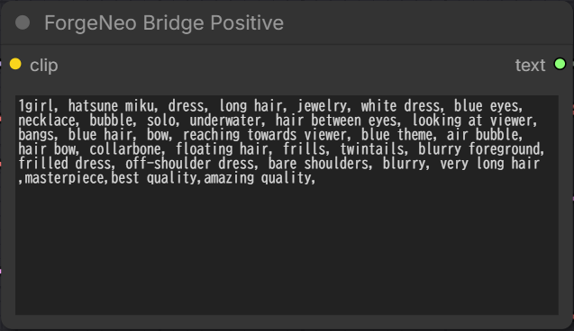

**Positive：** 元画像の正のプロンプトを読み込みます。通常のテキスト欄として編集でき、接続したCLIP／Text Encoderを使います。

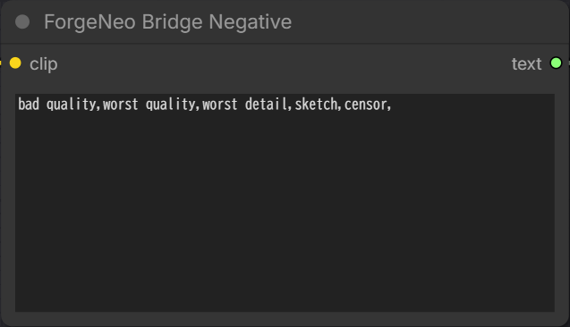

**Negative：** 負のプロンプトを編集します。これらはBridge専用Samplerへテキストとエンコーダーを渡すノードです。LoRAは接続されたLoaderで適用し、プロンプト欄にタグを追加しただけで重みを自動ロードしません。

### Bridge KSampler

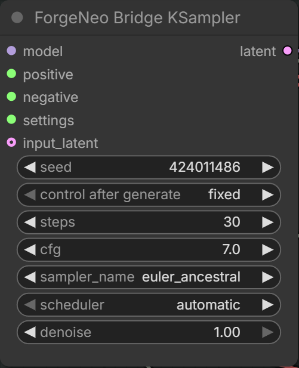

専用Samplerでも、読み込み後に**Seed・Steps・CFG・Sampler・Scheduler・denoiseを変更できます**。Seedは矢印・直接入力で編集し、`control after generate`で`fixed / increment / decrement / randomize`を選べます。新規読み込みはfixedです。ComfyUIの生成前／生成後のシード更新設定にも従います。

接続したLatentが基本サイズを決めます。標準Loader・Latent・VAE・保存ノードの名前は変更しません。保存済みの4つの旧ForgeCompatノードも互換用に残しています。

### Hires.fix

対応範囲は**SD1.5／SDXL／Animaで同じモデル・TE・VAEを使う構成**です。Lanczosの場合、次の編集可能な接続を作ります。

```text
1段目Sampler → VAE Decode → Upscale Image → VAE Encode
             → Hires Sampler → VAE Decode → Save Image
```

1段目はdenoise 1.0、2段目は画像に記録されたHires Steps・CFG・denoiseを使用します。AnimaのHires Shiftは2段目に反映します。補正ONはForgeのexact_steps、OFFはComfyUIの標準解釈です。

最終サイズは明示されたHires resizeを優先し、倍率だけが記録された画像では実画像の寸法を使います。テキストだけの場合は倍率計算を推定値として記録します。リサイズ済み画像ではなく原本を使ってください。標準Latent拡大の一部にも対応します。別モデル／Module／LoRAへの切り替えや学習型Upscalerは未対応です。

**Hires.fixは動作しても、Forge Neoと若干異なる結果になる場合があります。** 数値精度、VAE、拡大処理、ノイズ、サンプリング経路の違いが残るため、画素一致は保証しません。

### ワークフローを整列する

[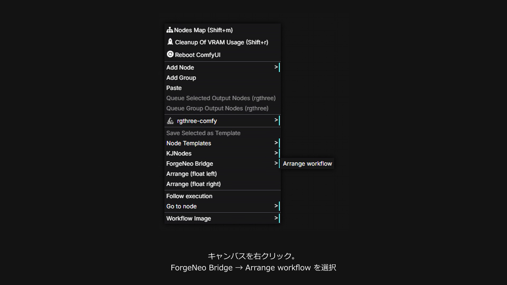](docs/media/arrange-ja.mp4)

**画像をクリックして日本語動画を開く** · [MP4](docs/media/arrange-ja.mp4) · [字幕SRT](docs/media/arrange-ja.srt)

キャンバスまたは対象ノードを右クリックして、**ForgeNeo Bridge → 配置を整える / Arrange workflow**を選びます。モデル・サイズ、プロンプト、基本生成、Hires、出力をグループ化し、Settingsを対応するSamplerの下へ配置します。常時ONのスイッチではなく、必要なときに一度実行する操作です。

Sampler下のプレビュー用余白と、保存画像を大きく表示する領域を確保します。設定値・接続は保持し、Ctrl+Zで戻せます。元Forge画像からの新規構築では自動配置し、保存済みComfyUIワークフローの位置は勝手に変更しません。複数のBridgeグラフがある場合は対象ノードを選択してください。

動画はユーザー提供スクリーンショットから作成した約23秒の説明です。各言語の女性合成音声・字幕・控えめなオリジナルBGM付きで、実操作の画面録画ではありません。

### 共存・既知の制約

- **MiniMax H3／LTXとの共存を考慮した設計：** ComfyUI全体のSampler関数や共有乱数状態を書き換えません。CPU試験で共有状態の保持を確認しています。ただしH3／LTXとの実生成による無干渉検証は未実施で、「すべての構成で競合しない」とは保証しません。
- Bridge専用Noise／Samplerへ動画モデルを誤接続した場合は拒否します。通常の動画ワークフローを書き換えません。他の拡張が行ったグローバルな変更を取り消す機能はありません。
- **整列の既知の問題：** グループ枠を含むコピー＆ペースト後の再整列では、古いグループIDにより枠が重複したり、別の手動枠が削除されたりする場合があります。コピー後の整列は避けてください。
- モデル不足・未対応設定は具体的なエラーにします。OOM時にサイズや精度を勝手に下げません。Sampler名が同じでも内部処理が同一とは限りません。

[サンプラー／Scheduler対応表と詳しい設定](docs/TECHNICAL_REFERENCE_JA.md) · [検証記録](docs/VALIDATION.md) · [実装仕様](docs/SPEC_JA.md) · [変更履歴](CHANGELOG.md)

実装系列：1.0.0。互換処理の基準は[Forge Neo 710f1e25](https://github.com/Haoming02/sd-webui-forge-classic/commit/710f1e25fcac84d880cbccf27d11b2e3276e589e)。AGPL-3.0：[LICENSE](LICENSE)／[同梱ソースの表記](THIRD_PARTY_NOTICES.md)。

---

<a id="english"></a>

## Drop a Forge image to create an editable ComfyUI workflow

[日本語 ↑](#japanese)

**ComfyUI-ForgeNeo-Bridge reads generation metadata from a Forge Neo image and builds an editable ComfyUI workflow when you drag and drop the image onto the canvas.** It restores prompts, model names, seed, steps, CFG, sampler, scheduler and dimensions, and connects nodes appropriate to the model family. You can then edit the workflow in ComfyUI.

There is no separate settings application or prerequisite workflow JSON. Drop the **original PNG, WebP or JPEG with its generation metadata intact**. Start generation with ComfyUI's normal Run/Queue action.

### Example: Illustrious / SDXL

<table>
<tr><th>Original Forge Neo image</th><th>Regenerated in ComfyUI</th></tr>
<tr>
<td><a href="docs/media/forge-illustrious.webp"></a></td>
<td><a href="docs/media/comfy-illustrious.png"></a></td>
</tr>
</table>

Model: `waiIllustriousSDXL_v170`. Seed **424011486**, Euler a, 30 steps, CFG 7, 1024×1344. Hires.fix: Lanczos, 2×, 20 steps, CFG 4.5, denoise 0.5. Both source files retain their full 2048×2688 resolution; only their HTML display width is reduced.


These are the settings recorded in the source image. **Hires.fix can produce slightly different results in Forge Neo and ComfyUI.** Upscaling, VAE re-encoding and sampling differences can also cause larger changes in composition or detail in some cases. This example does not guarantee identical or visually similar results for other images or models.

The left image demonstrates reconstruction from Forge generation metadata. Images containing a native ComfyUI workflow, such as the right image, use ComfyUI's existing workflow import instead.

### Install and update

Run inside ComfyUI's `custom_nodes` directory:

```powershell
git clone https://github.com/ukr8b3g-cmyk/ComfyUI-ForgeNeo-Bridge.git
```

To update, run `git pull --ff-only` inside this repository, then **restart ComfyUI and refresh the browser (F5)**. Re-drop the original image to rebuild an incomplete Hires workflow created by an older version.

The extension uses ComfyUI's existing dependencies. It does not run pip on startup or automatically download models. Lark is bundled in a private namespace; see [third-party notices](THIRD_PARTY_NOTICES.md).

### Import behavior

1. Drop the original Forge Neo image onto the ComfyUI canvas.
2. Bridge matches models, text encoders, VAEs and LoRAs against ComfyUI's registered folders.
3. It connects and arranges the nodes using the imported settings.
4. Edit the prompts or settings if needed, then press Run.

`ForgeNeo Bridge: canvas image to workflow` is **ON by default**. Matching uses registered relative paths, exact filenames and exact stems. Missing or ambiguous files keep the original name and an explanation; Bridge does not silently pick another model. Correct the relevant Loader before running. Dropping an image does not load weights onto the GPU or queue generation.

### Model recipes and verification

Workflow reconstruction and image similarity are separate capabilities.

| Family | Generated workflow | Verification and limitations |
|---|---|---|
| SD1.5 | Standard Checkpoint Loader + Bridge Prompt/Settings/Sampler | LCM + LoRA + Lanczos Hires completed on GPU; composition/clothing differ from the source |
| SDXL / Illustrious | Standard Checkpoint Loader + Bridge path | Comparison shown above; equivalence across models/settings is unverified |
| Anima | Separate model/TE/VAE loaders + Bridge path | `waiANIMA_v10Base10` Lanczos Hires completed with adjustments OFF and ON; user confirmed operation |
| Z-Image (ZIT) | Model-specific standard ComfyUI nodes | GPU generation and visual output checked with a compatible local configuration; exact original-weight parity unverified |
| ERNIE | Model-specific standard ComfyUI nodes | GPU generation and visual output checked with a compatible quantized model; original-weight parity unverified |
| Qwen-Image / Edit 2511, 2509 and original Edit | Standard nodes selected for text-only or reference-image generation | 2511 int8 + Lightning LoRA completed without references; 2509, original Edit and reference-editing paths are GPU-unverified |
| Qwen-Image 2.1 / Krea2 | Model-specific standard ComfyUI nodes | Recipes implemented; outside the current GPU checks. Qwen 2.1 reference-image editing is unsupported |
| Flux.1 Dev / Schnell | DualCLIPLoader and other standard nodes | Models unavailable locally; specification/wiring checks only, GPU-unverified |
| Flux.2 Klein / Dev | Flux2Scheduler + SamplerCustomAdvanced and model-specific loaders | Recipes implemented; outside the current GPU checks |

Wan video is outside scope. Lumina2/PiD have no supported recipe and are not routed through an inappropriate Checkpoint Loader. Formats requiring extra loaders, such as GGUF, are not guaranteed to execute with standard loaders. An edited output's metadata cannot recover its missing reference/input images.

`auto` is not a universal compatibility mode. It indicates that an unspecified field follows the model or supported profile. Examples include Clip Skip, Shift, Sigma min/max and Rho. The `automatic` scheduler is a separate setting. Native model recipes for Z-Image, Qwen, ERNIE and others are distinct from the dedicated Bridge Sampler path.

### Settings: everyday controls


Base and Hires Settings connect to their respective samplers. **This screenshot shows adjustments enabled; the default for a new import is OFF.** Changing compatibility or adjustments in a connected Hires pass synchronizes the same switch in the other pass.

| Control | Purpose |
|---|---|
| **Forge compatibility — default ON** | Master switch for Forge text processing, initial noise and related behavior. OFF invokes standard ComfyUI processing inside the same Bridge nodes. It does not convert them to standard nodes; Bridge must remain installed |
| **Sampling adjustments — default OFF** | Uses shared processing and compensates for sampling, sigma, intermediate-noise and CFG differences that affect reproducibility. Already compatible shared operations do not require this to be ON |
| Clip Skip | Encoder-layer handling. SD1.5/SDXL differ from Anima/LLM encoders; it is inactive for Anima |
| ENSD | Eta Noise Seed Delta, affecting the additional-noise random sequence. Retained but inactive with adjustments OFF |
| Import warnings | Missing, inferred and unsupported information. Click the same control again to close it |

**Sampling adjustments improves internal compatibility; it does not guarantee identical or visually similar images, and turning it ON need not make the result closer to Forge.** Even similarly named solvers can use different intermediate noise or schedules. Older workflows without this field load with adjustments ON to preserve prior behavior; new nodes and imports default to OFF.

| Forge compatibility | Sampling adjustments | Processing |
|---|---|---|
| OFF | Inactive | Standard ComfyUI text, noise and KSampler |
| ON | OFF (default) | Forge text/initial noise + ComfyUI samplers and sigma sequences |
| ON | ON | The above with Forge-oriented sampling adjustments |

### Advanced sections

Advanced controls start collapsed and retain their values when closed. The following crops show each section. Bridge labels and hover help follow ComfyUI's Japanese/English language selection. Enable ComfyUI's `Enable Tooltips` to display help.


**Model family / Mode:** The detected model family and generation mode. Hires uses txt2img for the base pass and img2img for the second pass.


**Text processing:** Emphasis controls prompt-weighting syntax. Comma backtrack controls how long prompts are split around commas. Used with Forge compatibility ON.


**Noise / variation:** RNG selects the initial-noise source. Subseed and Variation strength control variation seed mixing. Seed resize dimensions describe the initial-noise reference size, not output resolution.


**Sampling details:** Shift controls the time/noise scale for supported flow models. Eta controls stochastic noise in applicable samplers. S churn, S tmin, S tmax and S noise control intermediate noise. Applicability depends on the sampler and adjustment switch.


**Sigma / schedule:** Sigma bounds, Rho, Beta parameters and penultimate-sigma removal. SGM noise multiplier is an initial-noise scaling rule, not a scheduler name. These manual corrections are retained but inactive with adjustments OFF.


**CFG options:** Skip early CFG affects early CFG processing. NGMS controls conditional negative-guidance skipping; NGMS all steps changes its scope. Used on supported paths with compatibility and adjustments ON.


**Img2img details:** Step mode selects step/denoise interpretation; Extra noise controls additional noise. Hires uses these controls too. Adjustments OFF uses ComfyUI's standard interpretation.


**SDXL details:** Original/target dimensions and crop coordinates are additional SDXL conditioning. Edit output resolution on the connected latent/upscale node. Zero empty negative controls empty negative conditioning. This section appears for SDXL.


**Source information:** An independent section for inspecting imported source data; the crop shows its collapsed button. Source information is retained without overwriting the values you subsequently edit in ComfyUI.

### Prompt nodes


**Positive:** Imports the positive prompt into an editable text field and uses the connected CLIP/text encoder.


**Negative:** Edits the negative prompt. These nodes pass text and the encoder to the Bridge Sampler. Apply LoRAs through connected loaders; adding a LoRA tag to the text field does not implicitly load weights.

### Bridge KSampler


The dedicated sampler still lets you edit **Seed, Steps, CFG, Sampler, Scheduler and denoise** after import. Seed supports arrows and direct entry. `control after generate` offers `fixed / increment / decrement / randomize`; fresh imports use fixed. ComfyUI's before/after-generation seed-update preference is respected.

The connected latent controls base dimensions. Standard loaders, latent, VAE and save nodes retain their original names. The four legacy ForgeCompat nodes remain available for older workflows.

### Hires.fix

Supported for **SD1.5, SDXL and Anima using the same model, text encoder and VAE**. Lanczos creates this editable chain:

```text
Base Sampler → VAE Decode → Upscale Image → VAE Encode
             → Hires Sampler → VAE Decode → Save Image
```

The base pass uses denoise 1.0. The second uses recorded Hires steps, CFG and denoise, plus Hires Shift for Anima. Adjustments ON uses Forge's exact-step handling; OFF uses ComfyUI's standard interpretation.

Explicit Hires resize takes precedence. For image imports with only an upscale multiplier, the actual image dimensions determine the output size. Text-only imports mark multiplied dimensions as estimates. Use original images, not resized copies. Selected standard latent-upscale modes are also supported. Switching model/module/LoRA between passes and learned upscalers are unsupported.

**A successful Hires.fix run can still differ slightly from Forge Neo.** Precision, VAE, scaling, noise and sampling differences remain; pixel equality is not guaranteed.

### Arrange the workflow

[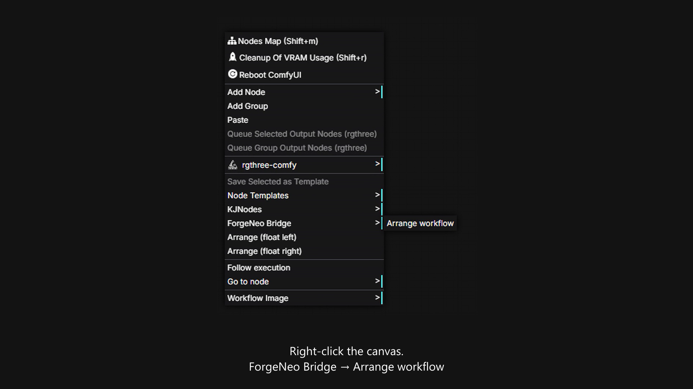](docs/media/arrange-en.mp4)

**Click the image to open the English video** · [MP4](docs/media/arrange-en.mp4) · [SRT captions](docs/media/arrange-en.srt)

Right-click the canvas or a target node and choose **ForgeNeo Bridge → Arrange workflow**. It groups model/size, prompts, base generation, Hires and output, placing Settings below its sampler. This is a one-time action, not a persistent ON/OFF switch.

It reserves preview space below samplers and enlarges the output-image area. Settings and connections stay intact; Ctrl+Z undoes the arrangement. Fresh Forge imports are arranged automatically, while saved ComfyUI workflows keep their stored positions. Select the target nodes when multiple Bridge graphs are present.

These approximately 23-second videos use user-provided screenshots, localized female synthetic narration, captions and quiet original music. They are illustrated explanations, not recordings of live UI actions.

### Coexistence and known limitations

- **Designed with MiniMax H3/LTX coexistence in mind:** Bridge does not replace global ComfyUI sampler functions or shared RNG state. CPU tests check shared-state preservation. End-to-end H3/LTX GPU coexistence is still unverified; conflict-free operation in every setup is not guaranteed.
- Video models mistakenly connected to the dedicated Bridge Noise/Sampler are rejected. Normal video workflows are not rewritten. Bridge does not undo global changes made by other extensions.
- **Known arrangement issue:** After copying/pasting groups together with nodes, stale group IDs can cause duplicate frames or deletion of an unrelated manually created frame. Avoid arranging a graph after group copy/paste.
- Missing models and unsupported settings produce specific errors. OOM does not silently reduce resolution or precision. Matching sampler names do not prove identical implementations.

[Detailed sampler/scheduler tables (Japanese)](docs/TECHNICAL_REFERENCE_JA.md) · [Validation records](docs/VALIDATION.md) · [Implementation specification (Japanese)](docs/SPEC_JA.md) · [Changelog](CHANGELOG.md)

Implementation series: 1.0.0. Compatibility reference: [Forge Neo 710f1e25](https://github.com/Haoming02/sd-webui-forge-classic/commit/710f1e25fcac84d880cbccf27d11b2e3276e589e). License: AGPL-3.0; see [LICENSE](LICENSE) and [third-party notices](THIRD_PARTY_NOTICES.md).
